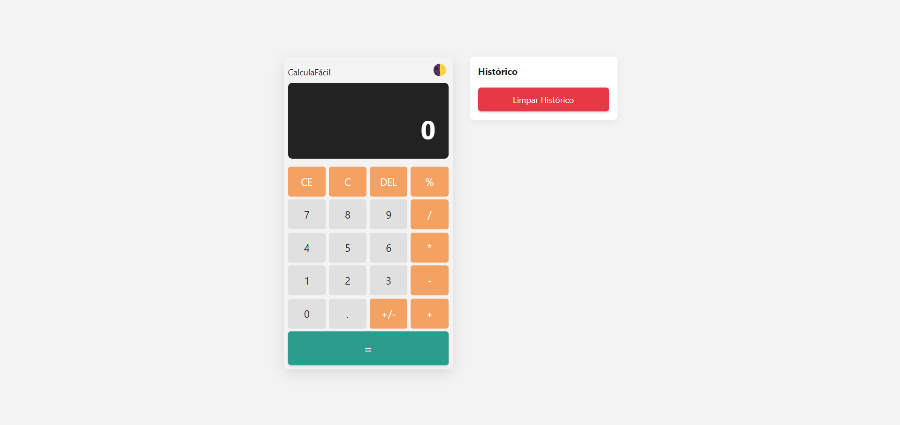

# 📱 CalculaFácil

Uma calculadora moderna e responsiva, desenvolvida com **HTML**, **CSS** e **JavaScript** puro. Ideal para treinar conceitos de DOM, lógica de programação e boas práticas de desenvolvimento front-end.

---

## ⚙️ Funcionalidades

- 🧮 Operações básicas: adição, subtração, multiplicação e divisão
- ➕➖ Inverter sinal (+/-)
- 📉 Porcentagem com lógica relativa (ex: `100 - 10%` → `90`)
- 🗑️ CE (limpar entrada) e C (limpar tudo)
- 🕹️ Suporte a teclado físico
- 🌓 Alternância de tema (claro/escuro)
- 📜 Histórico lateral de operações com botão "Limpar Histórico"
- ✅ Tratamento visual de erros (ex: divisão por zero)
- 📲 Totalmente responsiva para diferentes tamanhos de tela

---

## 💻 Tecnologias

- **HTML5** semântico
- **CSS3** com variáveis, transições e responsividade
- **JavaScript (ES6+)** com orientação a objetos

---

## 🧪 Como usar

1. Clone o repositório:

   ```bash
   git clone https://github.com/gabrielsilvacodes/calculafacil.git
   ```

2. Acesse a pasta do projeto e abra o arquivo `index.html` no navegador.

---

## 📸 Preview

<div align="center">
  
</div>

---

## 📝 Licença

Este projeto está sob a licença MIT. Veja o arquivo [LICENSE](LICENSE) para mais informações.
